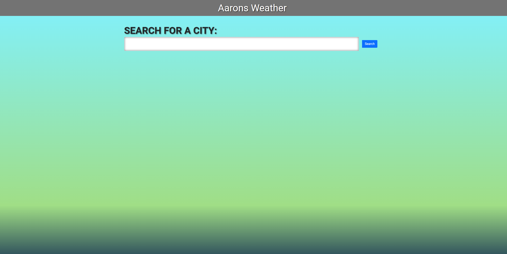
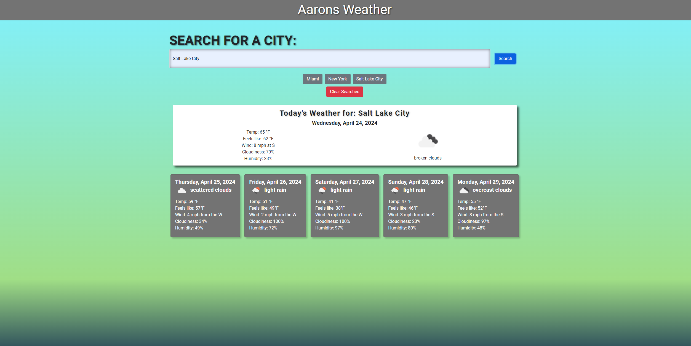

# Aarons Weather

Aarons Weather is a simple, user-friendly web application that provides real-time weather updates for any city. The website utilizes OpenWeatherMap's API to fetch weather data, including today's weather conditions and a 5-day forecast.

Description
• Aarons Weather is a simple, user-friendly web application that provides real-time weather updates for any city. The website utilizes OpenWeatherMap's API to fetch weather data, including today's weather conditions and a 5-day forecast.

Link to Deployed Application.
• [https://aaronbringhurst.github.io/aarons-weather/]
Link to GitHub Repo.
• [https://github.com/AaronBringhurst/aarons-weather]

# Screenshots

## Table of Contents

1. [Introduction](#introduction)
2. [Features](#features)
3. [Usage](#usage)
    - [Search Functionality](#search-functionality)
    - [Viewing Weather Data](#viewing-weather-data)
    - [Managing Search History](#managing-search-history)
4. [Credits](#credits)
5. [License](#license)
6. [Citations](#citations)
7. [Contact](#contact)

## Features

- **City Weather Search**: Easily search for real-time weather conditions in any city. The intuitive search feature allows users to quickly find and display weather data including temperature, wind, cloudiness, and humidity levels.

- **Dynamic Weather Updates**: The webpage fetches and displays today's weather and a 5-day forecast dynamically, ensuring that you have the most up-to-date information. Each weather condition is detailed with specific attributes like temperature, wind speed, and humidity.

- **Interactive UI with Historical Data**: Users can revisit their previous search queries with a single click, thanks to dynamically generated buttons that store historical search data. This feature enhances user experience by simplifying repeated searches for favorite or frequently visited locations.

- **Responsive and Adaptive Design**: Built with mobile-first design principles, the webpage adapts seamlessly across different devices and screen sizes, ensuring a consistent and accessible user experience whether on a desktop, tablet, or smartphone.

- **Local Storage Integration**: Your search history is saved locally, allowing you to clear this data with ease whenever necessary. This feature enhances user convenience by maintaining a list of previously searched cities and providing an option to reset this list.

- **Live Weather Icons and Descriptions**: Weather conditions are not just numbers and text. The site enhances user engagement by showing weather icons and descriptions that visually represent the current weather conditions, making it easy to understand at a glance.

- **Customizable UI Themes**: The website features a linear gradient background that blends beautifully from sky blue to deep navy, reflecting the various times of day and weather conditions, which users can customize to suit their preferences.

Each of these features contributes to a comprehensive and user-friendly weather tracking experience, designed to meet the needs of everyday users as well as weather enthusiasts.

## Usage

### Searching for Weather

Enter the name of the city in the search bar and submit to view the weather. The application will display current conditions and a five-day forecast.

### Viewing Weather Details

Weather details include temperature, humidity, wind speed, and overall conditions. These are displayed both as numeric data and through icons.

### Using Historical Search Data

Access your historical search data under the search bar. Click on any previously searched city name to quickly view current and forecasted weather.

## Technologies Used

- HTML5, CSS3, and JavaScript for frontend development.
- Bootstrap for responsive design.
- jQuery and jQuery UI for interactive components.
- OpenWeatherMap API for fetching weather data.

## Credits and Acknowledgments

Thanks to OpenWeatherMap for providing access to their APIs. Special thanks to [Name] for [specific contributions].

## License

Distributed under the MIT License. See `LICENSE` for more information.

## Citations

• GitHub: Let’s build from here. (n.d.). GitHub. https://github.com/

• GitLab. (n.d.). https://git.bootcampcontent.com/University-of-Utah/UofU-VIRT-FSF-PT-02-2024-U-LOLC

• Curriculum | University of Utah Professional Education Coding Boot Camp. (2024, March 6). University of Utah Professional Education Boot Camps. https://bootcamps.continue.utah.edu/coding/curriculum/

• JavaScript Array reference. (n.d.). https://www.w3schools.com/jsref/jsref_obj_array.asp

• JavaScript Array sort() Method. (n.d.). https://www.w3schools.com/jsref/jsref_sort.asp

• JavaScript arrays. (n.d.). https://www.w3schools.com/js/js_arrays.asp

• JavaScript string Methods. (n.d.). https://www.w3schools.com/js/js_string_methods.asp

• JavaScript String slice() Method. (n.d.). https://www.w3schools.com/jsref/jsref_slice_string.asp#:~:text=The%20slice()%20method%20extracts,second%20is%201%2C%20. • Pierce, D. (2022, November 28).

• return - JavaScript | MDN. (2023, August 11). MDN Web Docs. https://developer.mozilla.org/en-US/docs/Web/JavaScript/Reference/Statements/return

• GfG. (2023, December 7). Check if a variable is a string using JavaScript. GeeksforGeeks. https://www.geeksforgeeks.org/check-if-a-variable-is-a-string-using-javascript/

• ISNAN() - JavaScript | MDN. (2023, December 29). MDN Web Docs. https://developer.mozilla.org/en-US/docs/Web/JavaScript/Reference/Global_Objects/isNaN

• return - JavaScript | MDN. (2023, August 11). MDN Web Docs. https://developer.mozilla.org/en-US/docs/Web/JavaScript/Reference/Statements/return

• Better Comments - Visual Studio marketplace. (n.d.). https://marketplace.visualstudio.com/items?itemName=aaron-bond.better-comments

• Austin. (2021, June 11). How to build HTML forms right: Semantics. Austin Gil. https://austingil.com/how-to-build-html-forms-right-semantics/

• HTML footer Tag. (n.d.). https://www.w3schools.com/tags/tag_footer.asp

• Window localStorage property. (n.d.). https://www.w3schools.com/jsref/prop_win_localstorage.asp

• HTML forms. (n.d.). https://www.w3schools.com/html/html_forms.asp

• JavaScript HTML input examples. (n.d.). https://www.w3schools.com/js/js_input_examples.asp

• Day.js · 2kB JavaScript date utility library. (n.d.). https://day.js.org/en/

• OpenJS Foundation - openjsf.org. (n.d.). JQuery UI. https://jqueryui.com/

• Contributors, M. O. J. T. a. B. (n.d.). Bootstrap. https://getbootstrap.com/

• public-apis/public-apis: A collective list of free APIs. (n.d.). GitHub. https://github.com/public-apis/public-apis

## Contact Information

For any questions or suggestions, please contact:

- Aaron Bringhurst - [bringhurst.aaron@gmail.com](mailto:bringhurst.aaron@gmail.com)
- GitHub: [https://github.com/AaronBringhurst](https://github.com/AaronBringhurst)

Link to Deployed Application.
• [https://aaronbringhurst.github.io/aarons-weather/]
Link to GitHub Repo.
• [https://github.com/AaronBringhurst/aarons-weather]

